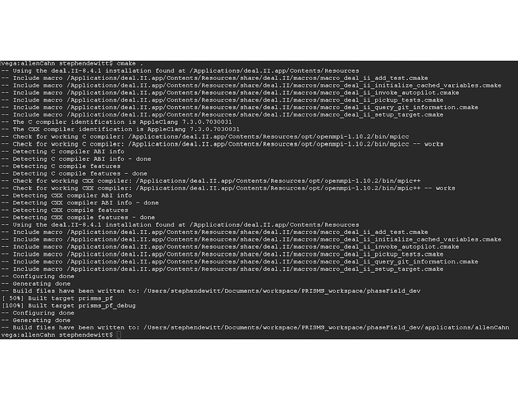

# Running a PRISMS-PF Example App {#running_apps}
## The Example Apps

After deal.II and PRISMS-PF are downloaded, you can run the pre-built PRISMS-PF example applications. At this time, the example applications include:
- allenCahn: An implementation of the Allen-Cahn equation for two phases. (2D)
- cahnHilliard: An implementation of the Cahn-Hilliard equation for two phases. (2D)
- coupledCahnHilliardAllenCahn: An implementation of the coupled Cahn-Hilliard/Allen-Cahn set of equations. (2D)
- CHAC_performance_test: An implementation of the coupled Cahn-Hilliard/Allen-Cahn set of equations for two growing particles used for benchmarking purposes. (3D)
- CHAC\_anisotropy: Coupled Cahn-Hilliard/Allen-Cahn equations with weakly anisotropic interfacial energy. (2D)
- CHAC\_anisotropyRegularized: Like CHAC\_anisotropy, but with a regularization term to permit strongly anisotropic interfacial energy. (2D)
- anisotropyFacet: A different strong anisotropy formation than in CHAC\_anisotropyRegularized that is easier to specify particular facets in the Wulff shape. (2D)
- steadyStateAllenCahn: An implementation of coupled Allen-Cahn and steady-state Allen-Cahn equations as a demonstration of the nonlinear solver. (2D)
- fickianDiffusion: An implementation of the diffusion equation with a time-dependent source term. (2D)
- mechanics: An implementation of linear elasticity for a material in uniaxial tension. (3D)
- CHiMaD\_benchmark1a: An implementation of the CHiMaD spinodal decomposition benchmark problem. (2D)
- CHiMaD\_benchmark2a: An implementation of the CHiMaD Ostwald ripening benchmark problem. (2D)
- CHiMaD\_benchmark3: An implementation of the CHiMaD dendritic solidification benchmark problem. (2D)
- CHiMaD\_benchmark6a: An implementation of the CHiMaD electrochemistry benchmark problem. (2D)
- CHiMaD\_benchmark6b: An implementation of the CHiMaD electrochemistry benchmark problem with a curved domain. (2D)
- dendriticSolidification: An implementation of a solidification model for a pure material resulting in the growth of a dendrite. (2D)
- eshelbyInclusion: An implementation of linear elasticity for a spherical inclusion. (3D)
- grainGrowth: An implementation of coupled Allen-Cahn equations simulating grain growth in two dimensions. (2D)
- grainGrowth_dream3D: An implementation of coupled Allen-Cahn equations simulating grain growth in two dimensions with an initial microstructure imported from Dream3D. (2D)
- precipiateEvolution: An implementation of the coupled Cahn-Hilliard/Allen-Cahn/Linear Elasticity equations often used in phase field simulation of precipitate evolution. (2D)
- precipiateEvolution_pfunction: Like precipitateEvolution, but loads inputs using PRISMS IntegrationTools. (2D)
- MgNd_precipitate_single_Bppp: Similar to precipiateEvolution, but uses the KKS model rather than the WBM model for the free energy functional. The parameters are set for $\beta$''' precipitates in an Mg-Nd alloy from [this publication](https://www.sciencedirect.com/science/article/pii/S1359645417305281) (3D)
- nucleationModel: KKS precipitation model that makes use of the PRISMS-PF explicit nucleation capabilities. (2D)
- nucleationModel_preferential: Like nucleationModel, but with a zone with an increased nucleation rate to simulate a grain boundary. (2D)

A directory for each of these apps can be found in the [applications directory](https://github.com/prisms-center/phaseField/tree/master/applications) (i.e. phaseField/applications). The apps contain a formulation file giving the governing equations. In addition to the 24 apps listed above, some app names may be preceded by an underscore. The underscore is used to denote apps that are still under active development.

## Compiling and Running the Allen-Cahn Example App

From the ''phaseField'' directory one can run the Allen-Cahn example application through to following terminal commands:
```
$ cd applications/allenCahn/
$ cmake .
$ make debug
$ mpirun -n 1 main
```

The first command moves from the ''phaseField'' directory to the directory of the Allen-Cahn example. The second command checks that core PRISMS-PF library has been compiled, (re-)compiles it if necessary, and creates a \emph{makefile} using CMake. The third command compiles the executable in ''debug'' mode, which enables a number of exception checks in the code and adds debugging information that can be used by a debugger (e.g. gdb). The fourth command runs the program using a single processor.

As the program runs, information from each time step outputs to the terminal window. After the simulation is complete, a summary the time taken in a few major sections of the code and the total wall time is printed to the terminal window.

Here is a screenshot of typical output from CMake as you create the \emph{makefile}:


Don't worry if the output isn't exactly the same as what you see, the details of some of the messages depend on your operating system and which compilers you have installed. The important part is that the bottom three messages are ''Configuring done'', ''Generating done'', and ''Build files have been written to: ...''. In the future, entering ''\$ cmake .'' will result in a shorter set of messages because CMake caches some variables from the last time it was run. As a result, you can omit the CMake step for future simulations as long as the path name to your current directory is unchanged and your installation of deal.II is unchanged.

Here is a screenshot of typical output from the compiler as you compile the executable:
\begin{figure}[H]
\vspace{0pt}
%\centering
\hspace{-2cm}
\includegraphics[width=1.3\textwidth]{compile_output}
\vspace{0pt}
\end{figure}
Depending on your version of deal.II, different warnings may appear as you compile. Common warnings include the use of functions that deal.II has marked as depricated (as in the screenshot above) and unused type definitions. In this case, PRISMS-PF uses these functions for backward compatability with deal.II version 8.4.x. We will switch to the updated functions in the near future.

Once the simultation is complete, the terminal output at the end of the simulation should look like:
\begin{figure}[H]
\vspace{-60pt}
\centering
\includegraphics[width=0.9\textwidth]{allenCahn_output}
\vspace{-60pt}
\end{figure}
